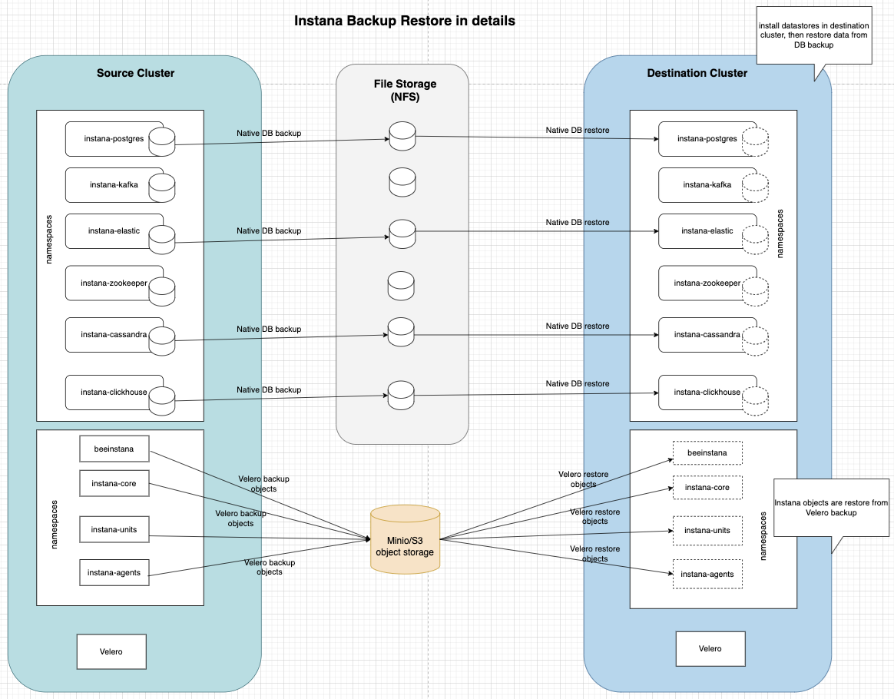

# Introduction

**This is a Blueprint for Instana Self-Hosted Custom Edition backup and restore**

This is a document provide an example to show the backup and restore of
Instana selfhosted customized eidition in Openshift Container Platform.

-   These steps are verified in selfhosted customized edition
    installation with default configurations. check the environment
    configurations for details
-   These steps might vary across different env and configurations.
-   The scripts provided might need modifications based on the
    customized environment.
-   The backup data can only be used to restore to the environment with
    exact same configurations. (i.e. DNS config, hostnames, core and
    unit configures, DB shard number, replica count settings.)
    
example environment configurations.

-   Instana Self-Hosted Custom Edition version 269-0
-   OCP Server Version: 4.14.33 x86_64
-   Kubernetes Version: v1.27.15+6147456
-   3 master nodes + 5 worker nodes
-   OADP v1.3.3

## Backup and restore flow
### Diagram
  
  
### Overall procedure
- Backup datastores with native backup tools follow the instructions provided.
  - Postgres, to persistent volume
  - Cassandra, to persistent volume
  - Elastic, to persistent volume
  - Clickhouse, to S3 storage
- Backup Instana Cluster to s3 storage with OADP backup.
- Restore OADP backup to the target cluster.
- Restore datastores with native restore tools follow the instructions provided.

## Storage for backup:

the assumption is the end user will use their onprem s3 storage. the
backup-restore script created are based on backing up to and restoring
from onprem s3 storage.

Minio server has been used in the test.

To install Minio server, refer to Minio instruction here:
<https://min.io/docs/minio/linux/operations/install-deploy-manage/deploy-minio-single-node-single-drive.html#minio-snsd>

### Create Minio access key

In Minio UI console, navigate to User\>Access Key to create Access Key
for later use in Clickhouse backup and restore.

### Create bucket in Minio Server

Navigate to Minio UI Administrator\>Buckes to create a bucket for later
use in Clickhouse backup/restore.

## Required software
  
1. Openshift OADP required for both source and target clusters.  
  install OADP: [Configuring OADP with ODF - OADP Application backup and
restore \| Backup and restore \| OpenShift Container Platform
4.14](https://docs.openshift.com/container-platform/4.14/backup_and_restore/application_backup_and_restore/installing/installing-oadp-ocs.html)    
2. Storage class is required for both source and target clusters.
2. Cert-manager is required for both source and target clusters.
3. Cassandra image version artifact-public.instana.io/self-hosted-images/3rd-party/datastore/cassandra:4.1.4_v0.17.0 is required to run Cassandra database backup and restore.

## Instructions
Please refer to the Instana backup restore documentation for detailed instructions.